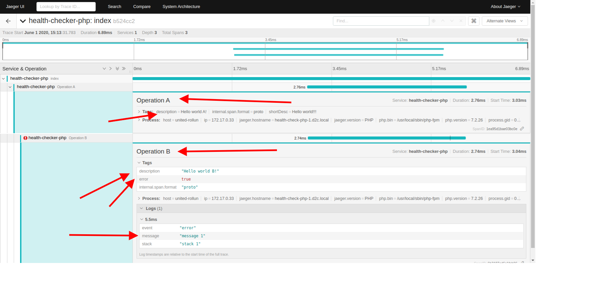

# rollun-logger

`rollun-logger` - библиотека которая расширяет [avz-cmf/zend-psr3-log](https://github.com/avz-cmf/zend-psr3-log),
которая в свою очередь есть прототипом библиотеки [zendframework/zend-log](https://github.com/zendframework/zend-log)
реализованой для [PSR-3: Logger Interface](https://www.php-fig.org/psr/psr-3/).

### Установка

Установить с помощью [composer](https://getcomposer.org/).
```bash
composer require rollun-com/rollun-logger
```

Переменные окружения:

    * Для логера:    
        - LOGSTASH_HOST - хост. logstash отправляет данные в elasticsearch.
        - LOGSTASH_PORT - порт.
        - LOGSTASH_INDEX - индекс. Рекомендуется писать то же название, что и в SERVICE_NAME только в ловеркейсе и через нижнее подчеркивание.
        
    * Для Jaeger:
        - TRACER_HOST - хост.
        - TRACER_PORT - порт.
        
    * Для метрики:    
        - METRIC_URL - урл метрики   
        - PROMETHEUS_HOST - хост Prometheus
        - PROMETHEUS_PORT - порт Prometheus. По умолчанию 9091

### Getting Started

По скольку это расширение к `zend-log`, базовою документацию можно почитать 
[здесь](https://framework.zend.com/manual/2.4/en/modules/zend.log.overview.html).


#### Writes

- **Http** - логирует данные по указанному [URI](https://en.wikipedia.org/wiki/Uniform_Resource_Identifier) пути.
- **HttpAsync** - асинхронно логирует данные по указанному [URL](https://en.wikipedia.org/wiki/URL) пути.
- **HttpAsyncMetric** - расширяет HttpAsync и асинхронно пишет метрику по указанному [URL](https://en.wikipedia.org/wiki/URL) пути. Writer подключен по умолчанию и пишет логи на урл который указан в переменных окружения (METRIC_URL).
- **PrometheusMetric** - пишет метрику на Prometheus методом pushGateway. Есть возможность указать Prometheus хост и порт. На данный момент поддерживается только тип метрики "Измеритель"(gauge). Writer подключен по умолчанию и пишет логи на хост и порт который указан в переменных окружения (PROMETHEUS_HOST, PROMETHEUS_PORT).    

#### Formatters

- **ContextToString** - декодирует `$event` в `json`.


#### Processors

- **LifeCycleTokenInjector** - добавляет `LifeCycleToken` токены под соответственными ключами: 
    - `LifeCycleToken::KEY_LIFECYCLE_TOKEN` (`lifecycle_token`);
    - `LifeCycleToken::KEY_ORIGINAL_LIFECYCLE_TOKEN` (`original_lifecycle_token`);
    - `LifeCycleToken::KEY_PARENT_LIFECYCLE_TOKEN` (`parent_lifecycle_token`);
    - `LifeCycleToken::KEY_ORIGINAL_PARENT_LIFECYCLE_TOKEN` (`original_parent_lifecycle_token`).
- **IdMarker** - добавляет к массиву `$event` автосгенерированый идентификатор под ключом `id`.
- **ExceptionBacktrace** - достает с `$context`, обрабатывает `exception` объект и помещает результат под ключем 
`backtrace`.

Пример:

```php
<?php

use rollun\logger\Processor\ExceptionBacktrace;

// According to psr-3 standard put exception under 'exception' key
$previousException = new \Exception('Previous error', 1);
$event['context']['exception'] = new \Exception('Error eccurred', 2, $previousException);
$processor = new ExceptionBacktrace();
$event = $processor->process($event);

print_r($event['context']['backtrace']);
/* Output
[
    [
        'line' => 22,
        'file' => 'someFile.php',
        'code' => 2,
        'message' => 'Error eccurred',
    ],
    [
        'line' => 34,
        'file' => 'someElseFile.php',
        'code' => 1,
        'message' => 'Previous error',
    ],
]
*/
```

### LifeCycleToken

`LifeCycleToken` - это объект который генерирует токены для определения приложения в котором была залогирована
информация. Для того чтобы использовать `LifeCycleToken` приложении нужно добавить следуйщий код в `index.php` в Вашем
приложении.

```php
<?php
use Interop\Container\Exception\ContainerException;
use Psr\Log\LoggerInterface;
use rollun\logger\LifeCycleToken;
use rollun\logger\SimpleLogger;

// Self-called anonymous function that creates its own scope and keep the global namespace clean
call_user_func(function () {
    // Init lifecycle token
    $lifeCycleToken = LifeCycleToken::generateToken();

    if (LifeCycleToken::getAllHeaders() && array_key_exists("LifeCycleToken", LifeCycleToken::getAllHeaders())) {
        $lifeCycleToken->unserialize(LifeCycleToken::getAllHeaders()["LifeCycleToken"]);
    }

    // Use container method to set service
    /** @var \Zend\ServiceManager\ServiceManager $container */
    $container = require "config/container.php";
    $container->setService(LifeCycleToken::class, $lifeCycleToken);

    try {
        $logger = $container->get(LoggerInterface::class);
    } catch (ContainerException $containerException) {
        $logger = new SimpleLogger();
        $logger->error($containerException);
        $container->setService(LoggerInterface::class, $logger);
    }

    $logger = $container->get(LoggerInterface::class);
    $logger->notice("Test notice. %request_time", ["request_time" => $_SERVER["REQUEST_TIME"]]);
});
```


### Конфигурация

Для того чтобы начать быстро использовать логер в Вашем приложении, нужно внести следующие конфигурации в 
конфигурационный файл для [Service Manager](https://github.com/zendframework/zend-servicemanager).
```php
<?php

return
    [
        'log_formatters' => [
            'factories' => [
                'rollun\logger\Formatter\ContextToString' => 'Zend\ServiceManager\Factory\InvokableFactory',
            ],
        ],
        'log_filters' => [
            'factories' => [
            ],
        ],
        'log_processors' => [
            'factories' => [
                'rollun\logger\Processor\IdMaker' => 'Zend\ServiceManager\Factory\InvokableFactory',
                'rollun\logger\Processor\LifeCycleTokenInjector' => 'rollun\logger\Processor\Factory\LifeCycleTokenReferenceInjectorFactory',
            ],
        ],
        'log_writers' => [
            'factories' => [
            ],
        ],
        'dependencies' => [
            'abstract_factories' => [
                'Zend\Log\LoggerAbstractServiceFactory',
                'Zend\Db\Adapter\AdapterAbstractServiceFactory',
            ],
            'factories' => [
                'Zend\Log\Logger' => 'Zend\Log\LoggerServiceFactory',
                'LogFilterManager' => 'Zend\Log\FilterPluginManagerFactory',
                'LogFormatterManager' => 'Zend\Log\FormatterPluginManagerFactory',
                'LogProcessorManager' => 'Zend\Log\ProcessorPluginManagerFactory',
                'LogWriterManager' => 'Zend\Log\WriterPluginManagerFactory',
            ],
            'aliases' => [
                'logDbAdapter' => 'Zend\Db\Adapter\AdapterInterface',
            ],
        ],
        'log' => [
            'Psr\Log\LoggerInterface' => [
                'processors' => [
                    [
                        'name' => 'rollun\logger\Processor\IdMaker',
                    ],
                    [
                        'name' => 'rollun\logger\Processor\LifeCycleTokenInjector',
                    ],
                ],
                'writers' => [
                    [
                        'name' => 'Zend\Log\Writer\Db',
                        'options' => [
                            'db' => 'logDbAdapter',
                            'table' => 'logs_test_log',
                            'column' => [
                                'id' => 'id',
                                'timestamp' => 'timestamp',
                                'message' => 'message',
                                'level' => 'level',
                                'priority' => 'priority',
                                'context' => 'context',
                                'lifecycle_token' => 'lifecycle_token',
                            ],
                            'formatter' => 'rollun\logger\Formatter\ContextToString',
                        ],
                    ],
                ],
            ],
        ],
    ];
```

### Jaeger tracing
С помощью Jaeger мы выполняем трассировку сервисов для отладки. Для хранения трейсов используется ElasticSearch.
Для подключения необходимо установить несколько переменных окружения:
 * SERVICE_NAME **обязательно** - для определения кто оправляет трейс
 * TRACER_HOST **обязательно** - для определения на какой хост отправить трейс
 * TRACER_PORT **не обязательно** - по умолчанию 6832. Для определения на какой порт отправлять трейс
 * TRACER_DEBUG_ENABLE **не обязательно** - по умолчанию включен. Трейсы пишуться только при включенном TRACER_DEBUG_ENABLE. По сути этот параметр влияет на настройки [sampling](https://www.jaegertracing.io/docs/1.17/sampling/#client-sampling-configuration). 
 
 смотри [пример](../.env.dist).
 
Пример использования
```php
<?php
declare(strict_types=1);

namespace App\Handler;

use Jaeger\Log\ErrorLog;
use Jaeger\Tag\ErrorTag;
use Jaeger\Tag\StringTag;
use Jaeger\Tracer\Tracer;
use rollun\dic\InsideConstruct;

/**
 * Class Foo
 */
class Foo
{
    /**
     * @var Tracer
     */
    protected $tracer;

    public function __construct(Tracer $tracer = null)
    {
        InsideConstruct::init(
            [
                'tracer' => Tracer::class,
            ]
        );
    }

    public function run()
    {
        $this->operationA();
    }

    protected function operationA()
    {
        $span = $this->tracer->start('Operation A', [new StringTag('description', 'Hello world A!')]);

        // adding string tag
        $span->addTag(new StringTag('shortDesc', 'Hello world!!!'));

        $this->operationB();

        $this->tracer->finish($span);

    }

    protected function operationB()
    {
        $span = $this->tracer->start('Operation B', [new StringTag('description', 'Hello world B!')]);

        // adding error tag
        $span->addTag(new ErrorTag());

        // add error log
        $span->addLog(new ErrorLog('message 1', 'stack 1'));

        $this->tracer->finish($span);
    }
}
```
Результат:

Из примера видно, что нужно открывать и закрывать операции, поддерживаются вложенные операции. Во время выполнения кода нужно добавлять разного рода теги для отладки. Тег нужен для быстрого поиска трейтов. В примере мы показали текстовый тег, тег ошибку, а также добавили лог ошибки. Библиотека поддерживает и другие [теги](https://github.com/code-tool/jaeger-client-php/tree/master/src/Tag).
 

### Метрика
При помощи врайтеров **HttpAsyncMetric** и **PrometheusMetric** есть возможность отправлять метрику.

Принято, что в метрику попадают только warning и notice. Также для метрик используется специальное название события.

Пример отправки метрик:
```php
$logger->warning('METRICS', ['metricId' => 'metric-1', 'value' => 100]);
// в результате будет отправлен асинхронный POST запрос на http://localhost/api/v1/Metric/metric-1 с телом {"value": 100,"timestamp": 1586881668}

$logger->notice('METRICS', ['metricId' => 'metric-2', 'value' => 200]);
// в результате будет отправлен асинхронный POST запрос на http://localhost/api/v1/Metric/metric-2 с телом {"value": 200,"timestamp": 1586881668}
```


